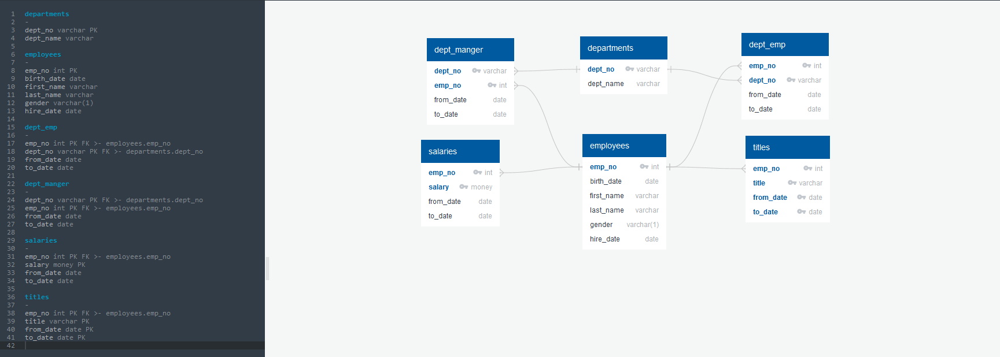

# sql-challenge
## CWRU Data Analysis Bootcamp  - SQL Homework

--------
## Objectives
* Perform Data Modeling, Data Engineering, and Data Analysis on employee files of a corporation from the 1980s and 1990s
* Design tables in SQL to hold data from CSV files
* Import CSVs to SQL Database
* Answer questions about the data
* Import SQL database into Pandas and create graphs from the data
---------
## Contents
### EmployeeSQL/:
Data Folder: 6 CSV files of various employee data tables\
schema.sql: Table creation SQL file. Creates tables based on Entity Relationship Diagram\
queries.sql: Query SQL file that runs 8 queries to examine data using various SQL functions\
emp_data.ipynb: Jupyter Notebook that imports data from SQL database and plots graphs based on the data\
Data_ERD.png: Entity Relationship Diagram that shows Primary Key and Foreign Keys of the tables created in SQL

## Results
Analysis located in queries.sql and emp_data.ipynb markdown
